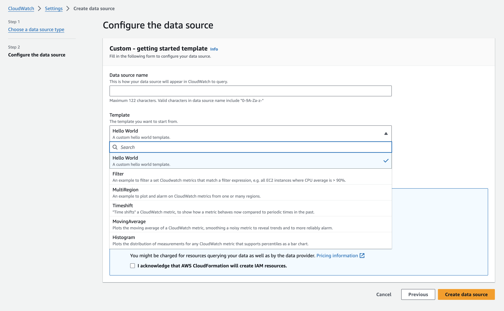

# CloudWatch Data Source Samples

[](LICENSE)
[](https://docs.aws.amazon.com/AmazonCloudWatch/latest/monitoring/WhatIsCloudWatch.html)

## What are CloudWatch Data Sources?

CloudWatch Data Sources is a new capability of Amazon CloudWatch that offers you a consolidated monitoring experience within the CloudWatch console, to view and alarm on your hybrid, multicloud, and third-party metrics data in one place. It helps you reduce mean time to resolution of critical events, gain visibility into your applications health, and surface insights faster for seamless operations.

CloudWatch Data Sources runs on AWS Lambda that we deploy on your behalf which are responsible for connecting to the data source, retrieving data for the time range that you need, and doing any adjustments needed for visualization or alarming, such as resampling the data to match the granularity that you need.

## How to setup?

Within this repository you will find the source code for different CloudWatch Data Source samples in JavaScript: hello world, time shift, multi region, moving average, filter and histogram.

Samples can be setup directly from the CloudWatch console:

1. Go to the [CloudWatch console](https://console.aws.amazon.com/cloudwatch/)
2. Click "Settings" from the left navigation bar
3. Click "Metrics data sources"
4. Click "Create data source"
5. Select "Custom - getting started template" and click "Next"
6. Finally you will be able to select the following: \
  6.1. Data source name \
  6.2. Template: hello world, time shift, multi region, moving average, filter and histogram \
  6.3. Runtime: NodeJS or Python
7. Click "Create data source"

<div align="center">

    

</div>

## Hello world sample

Generates a sample time series at a given value across a time range.

### Query arguments

Param | Type | Description
---|---|---
1 | String | The name of the time series
2 | Number | The value returned for all data points in the time series

### Example expression

```
LAMBDA(<LAMBDA_FUNCTION_NAME>, 'metricLabel', 10)
```

## Time shift sample

"Time shifts" a CloudWatch Metric, to show how a metric behaves now compared to periodic times in the past. It also enables alarming on data from up to 15 months ago.

#### Query arguments

| Param |  Type  |                                                                 Description                                                                  |
| ----- | ------ | -------------------------------------------------------------------------------------------------------------------------------------------- |
|   1   | String | The full name of the metric, in format `<Namespace>, <MetricName>, <Dim Name 1>, <Dim Value 1>,...` etc. URL encode the strings between commas |
|   2   | String |                                                   The statistic to retrieve for the metric                                                   |
|   3   | String |                            The shift interval, in ISO 8601 duration format, e.g. P7D for 1 week, PT3H for 3 hours                            |
|   4   | Number |                                             The number of shifts to perform, between 1 and 10                                              |

#### Example expression

Plot number of calls to CloudWatch GetMetricData, day over day for past 8 days (current, plus 7 timeshifts of 1 day)
```
LAMBDA(<LAMBDA_FUNCTION_NAME>, 'AWS/Usage, CallCount, Type, API, Resource, GetMetricData, Service, CloudWatch, Class, None', 'Sum', 'P1D', 7)
```
Compare number of calls to CloudWatch GetMetricData today versus a week ago, as percent of how it has changed - which can be alarmed on. This is done with 4 expressions on the graph, listed below with their metric ids. The final "metric", percentChange, calculates the percentage change - alarm on this, and set the other "metrics" to invisible.
```
timeshift = LAMBDA(<LAMBDA_FUNCTION_NAME>, 'AWS/Usage, CallCount, Type, API, Resource, GetMetricData, Service, CloudWatch, Class, None', 'Sum', 'P7D', 1)
current = FIRST(timeshift)
previous = LAST(timeshift)
percentChange = IF(previous != 0, current / previous * 100)
```

## Multi region sample

Loads a CloudWatch metric from one or more regions. This enables:

* Alarming on a metric in a different region
* Alarming on combination of metrics from multiple regions

#### Query arguments

| Param |  Type  |                                                                    Description                                                                    |
| ----- | ------ | ------------------------------------------------------------------------------------------------------------------------------------------------- |
|   1   | String |   The full name of the metric, in format `<Namespace>, <MetricName>, <Dim Name 1>, <Dim Value 1>,...` etc. URL encode the strings between commas.   |
|   2   | String | The [CloudWatch statistic](https://docs.aws.amazon.com/AmazonCloudWatch/latest/monitoring/Statistics-definitions.html) to retrieve for the metric |
|   3   | String |                                Comma-separated lists of regions to load metric from, e.g. `us-east-1, eu-west-1`                                |

#### Example expression

Sum the total calls to CloudWatch GetMetricData in us-east-1 and eu-west-1, ready for alarming on:
```
SUM(LAMBDA('<LAMBDA_FUNCTION_NAME>', 'AWS/Usage, CallCount, Type, API, Resource, GetMetricData, Service, CloudWatch, Class, None', 'Sum', 'us-east-1, eu-west-1'))
```

Display the average EC2 CPU usage across US regions.
```
LAMBDA(<LAMBDA_FUNCTION_NAME>, 'AWS/EC2, CPUUtilization', 'Average', 'us-east-1, us-east-2, us-west-1, us-west-2')
```

## Moving average sample

Returns the moving average for a CloudWatch Metric. Each datapoint is the average of the original datapoint and the trailing N - 1 datapoints. Missing data is ignored.

#### Query arguments

| Param |  Type  |                                                                Description                                                                |
| ----- | ------ | ----------------------------------------------------------------------------------------------------------------------------------------- |
|   1   | String | The full name of the metric, in format `<Namespace>,<MetricName>,<Dim Name 1>,<Dim Value 1>,...` etc. URL encode the strings between commas |
|   2   | String |                                                 The statistic to retrieve for the metric                                                  |
|   3   | Number |                                            The number of datapoints to average, from 2 upwards                                            |

#### Example expression

Plot 10-datapoint moving average of EC2 CPU usage:
```
LAMBDA('MovingAverage', 'AWS/EC2,CPUUtilization', 'Average', 10)
```

## Filter sample

Filters metrics whose values match a condition, such as show only metrics where average of all values > 70.

This enables use cases like:

* Show only problematic resources on my dashboard, e.g. graph only EC2 instances with high CPU
* Alarm on sum of all metrics matching a CloudWatch [metricsearch expression](https://docs.aws.amazon.com/AmazonCloudWatch/latest/monitoring/search-expression-syntax.html)

Runs a valid CloudWatch Metric expression and returns all metrics that match the specified filter expression. Leave the filter expression blank to match all metrics.

#### Query arguments

| Param |  Type  |                                                                                               Description                                                                                               |
| ----- | ------ | ------------------------------------------------------------------------------------------------------------------------------------------------------------------------------------------------------- |
|   1   | String |                                               Expression, e.g. CPU for EC2 instances: `SEARCH('{AWS/EC2,InstanceId} Metric=CPUUtilization)', 'Average')`                                                |
|   2   | String | Filter, in form `<stat> <condition> <value>`, where `<stat>` can be MIN,MAX,AVG, SUM and `<condition>` can be >, >=, <, <=, ==, !=. e.g. `MAX > 70` shows only metrics that have some datapoints above 70 |

#### Example expression

Average CPU of all EC2 Instances using SEARCH, by setting filter to empty string. This metric can be alarmed on.
```
AVG(LAMBDA('<LAMBDA_FUNCTION_NAME>', 'SEARCH("{AWS/EC2,InstanceId} Metric=CPUUtilization)", "Average"))', '')
```

## Histogram sample

Plots a logarithmic distribution of measurements for any CloudWatch metric that supports [percentiles](https://docs.aws.amazon.com/AmazonCloudWatch/latest/monitoring/cloudwatch_concepts.html#Percentiles).

* To be able to see the graph, select _Bar_ chart visualization in _Graph options_
* Height of each bar is the number of samples in each bucket
* Label of each bar is "center" value of bucket
* Moving the graph legend to the right can help with visualizing

### Query arguments

| Param |  Type  |                                                                  Description                                                                  |
| ----- | ------ | --------------------------------------------------------------------------------------------------------------------------------------------- |
|   1   | String | The full name of the metric, in format `<Namespace>, <MetricName>, <Dim Name 1>, <Dim Value 1>,...` etc. URL encode the strings between commas. |
|   2   | Number |        (optional) max number of buckets, number from `${MIN_BUCKET_COUNT}` to `${MAX_BUCKET_COUNT}` (defaults to `${DEFAULT_BUCKET_COUNT}`)         |

#### Example expression

Plot the histogram of all Lambda function calls:
```
LAMBDA(<LAMBDA_FUNCTION_NAME>, 'AWS/Lambda, Duration', 100)
```

## Security

See [CONTRIBUTING](CONTRIBUTING.md#security-issue-notifications) for more information.

## License

This library is licensed under the MIT-0 License. See the LICENSE file.

